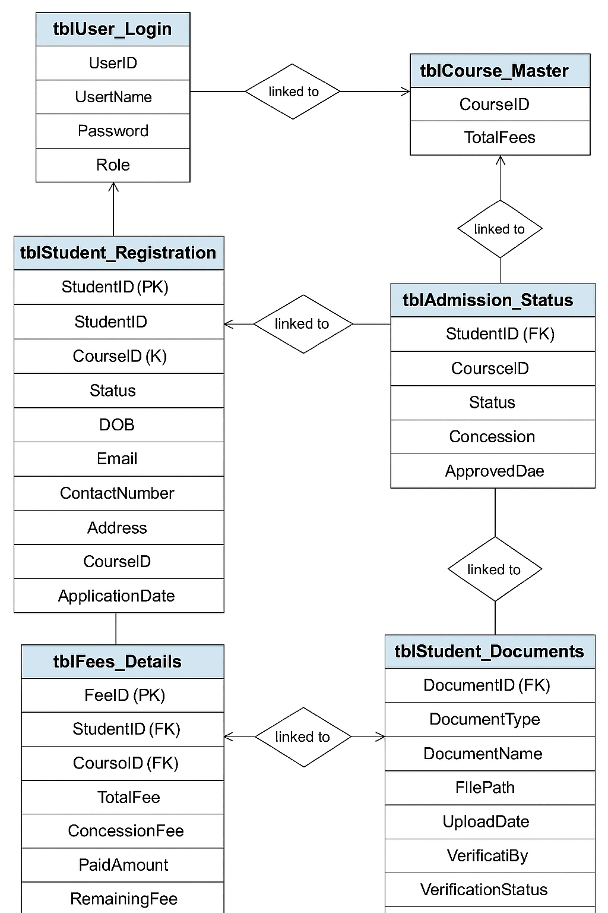
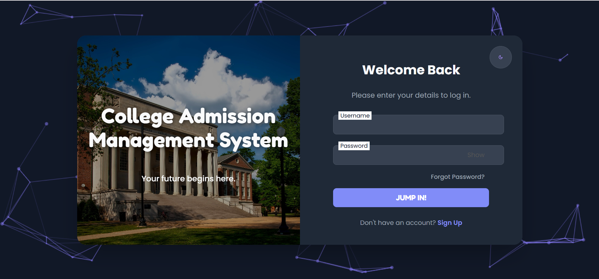
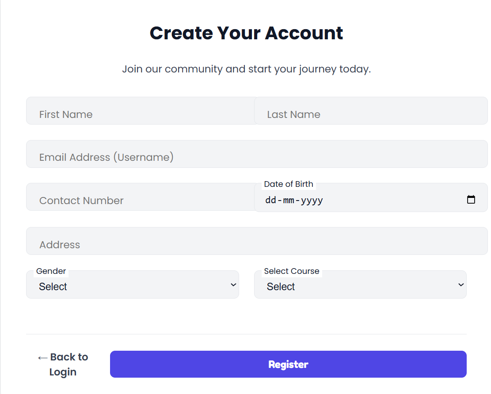
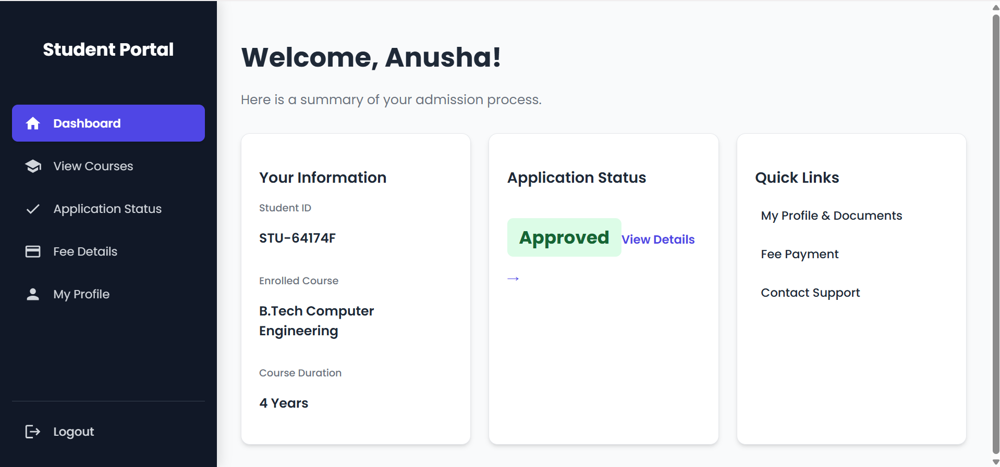
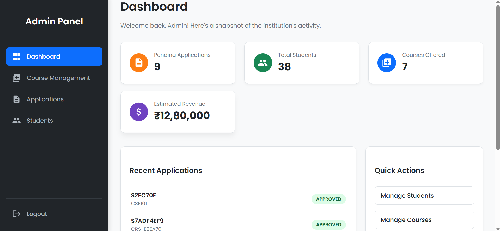
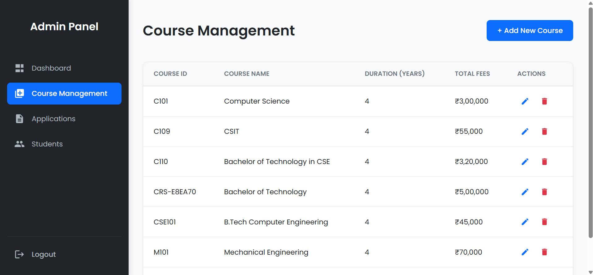

# college-admission-management-system
A Spring Boot and React based College Admission Management System with student registration, admission status tracking, and course management.

## Architecture

The following diagram shows the high-level architecture of the system:

## 🗃️ Database Schema (ERD)

The Entity Relationship Diagram below shows the structure of the application's database.

**Tables:**
- **student:** Stores student personal information.
- **application:** Records each application a student submits.
- **course:** Contains the available courses for admission.

## 🖥️ User Interface (Screenshots)

Here's a walkthrough of the main features and interfaces of the College Admission Management System.

### For Students & Applicants

#### 1. Login Page
A clean and secure login interface for both students and administrators.

#### 2. Student Registration
The form for new students to create an account and join the platform.

#### 3. Student Dashboard
The personalized hub for students, providing an overview of their application status and quick access to all features.

---

### For Administrators

#### 4. Admin Dashboard
The admin control center, offering a high-level snapshot of institutional activity, including pending applications, revenue, and total students.

#### 5. Course Management
The interface where administrators can view, add, edit, and manage all courses offered by the institution.
